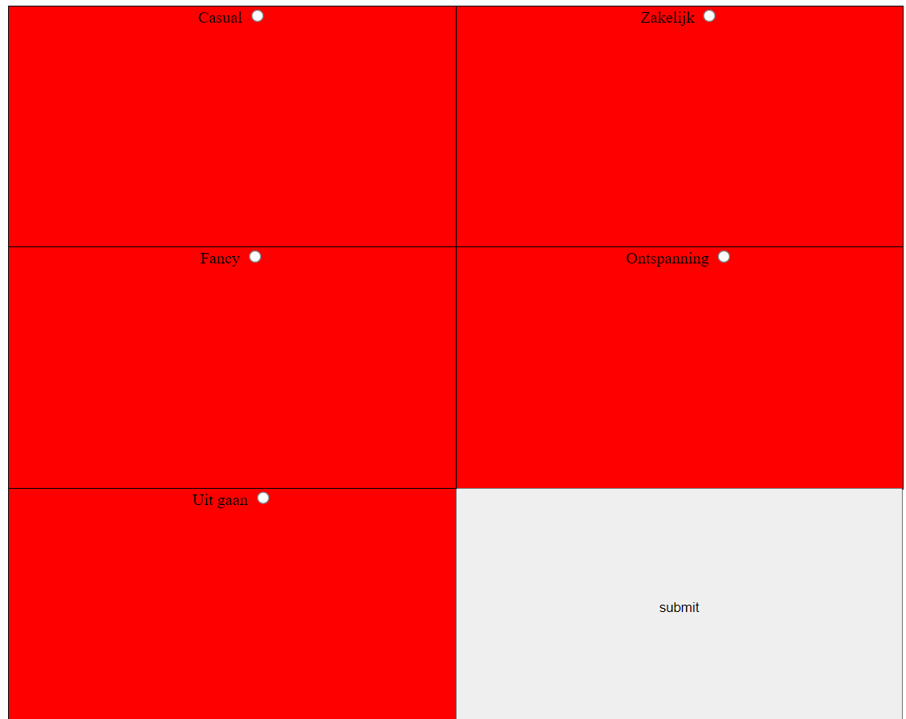

# Find And wear

## Onderzoeksvraag
Hoe kan Petra kiezen wat voor kleding ze wilt dragen? 

## Probleemdefinitie
Petra is blind. Bij het navigeren gebruikt ze een aantal hulpmiddelen, waaronder een toetsenbord met braille regel en een screenreader.
Helaas kan dat niet bij alles gebruikt worden. Petra heeft een kast vol kleren die ze graag op het juiste moment wil kunnen gebruiken.
Hoe kan ze de juiste kleding stukken vinden als ze blind is ?

## Oplossing
De applictaie die ik heb gemaakt is een simple app, waarbij de focus is gelegd op het navigeren. Bij het starten van de app heeft petra de mogelijkheid om te lusiteren naar de uitleg van de applicatie. Elke scherm heeft een x aantal antwoorden waaruit ze kan kiezen. Om de keuze te bevestigen hoeft ze rechts onder op het scherm te klikken en dan gaat ze door naar de volgende pagina. Haar keuzes worden dan ook uitgelzen zodat ze een terug kijk krijgt over wat ze heeft geselecteerd.

## Link prototype
[HDC App](hcd-production.up.railway.app)

